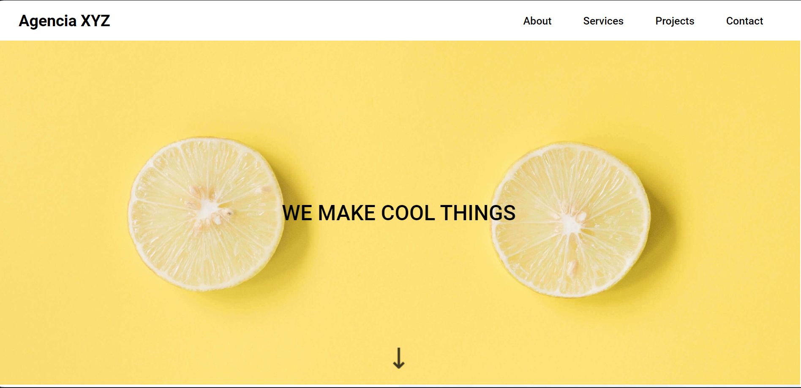

# Site landing page 🍋
Este projeto consiste em uma landing page de uma empresa empresa fictícia. O projeto é ideal para iniciantes que querem  praticar habilidades de HTML e CSS.

## Funcionalidade
Design responsivo: A página é responsiva, adequando-se a diferentes tamanhos de tela.

## Tecnologias Usadas

- HTML5
- CSS3

## Estrutura de Arquivos

Site landing page
- index.html
- src (Organizado com as respesctivas paginas Imagens; CSS; webfonts)

## Como Executar o Projeto

1. Clone o repositório para sua máquina local:https://github.com/guilherme-silvam/agenciaXYZ-ladin-page.git
2. Abra o arquivo `index.html` em um navegador de sua preferência.

## Visualização

Aqui está uma prévia de como o site aparece(Clique na imagem caso queira acessar o site)

## Contato

- E-mail: guisilvam19@gmail.com ou  guilhermemachado019@gmail.com
- Projeto Link: 